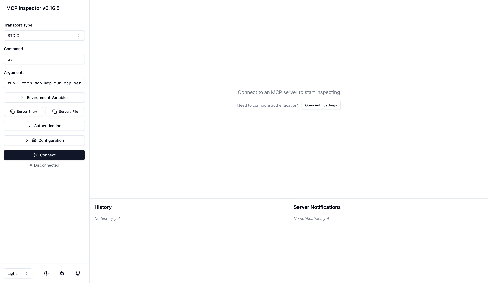

# hotfix_repair(new-branch-MCP)
## Project Structure
```
new-branch-MCP/
├── fixed_input/                # 存放需要修補的原始程式碼
│   ├── vulnerable_example.txt  # 範例：包含漏洞的程式碼
│   └── test.txt                # 測試用的輸入檔案
├── fixed_output/               # 存放修補後的程式碼
│   └── fixed_test.txt          # 修補後的程式碼輸出
├── repaire_main.py             # 主程式，用於修補程式碼漏洞
├── mcp_server.py               # MCP 伺服器主程式
├── repair_core.py              # 核心修補邏輯
├── commandLine_fix.py          # 命令列工具，用於修補程式碼
├── .env                        # 環境變數檔案，包含 API 金鑰
├── requirements.txt            # Python 套件需求檔案
└── README.md                   # 使用說明文件
```
## Set Enviroment
```
set the virtual machine: 
python3 -m venv myenv
source myenv/bin/activate
pip install -r requirement.txt
```

### How to Test
#### Way1: Using command line tools
```
python cli_fix.py --input vuln.c --function_name vulnerable_function
# 成功後會在 fixed_output/ 看到 fixed2_vuln.txt
```
#### Way2: Starting the MCP server -> Testing with the Developer Inspector
After installing mcp[cli], an mcp command will be available, providing development/testing tools. Use its Inspector to connect to your server directly:
```
# 方式 A：一行開 Inspector（會自動幫你啟動 server 並連線）
mcp dev mcp_server.py

```


## Test Result
1. Tools: `patch_code`


2. Tools: `patch_code_with_error

